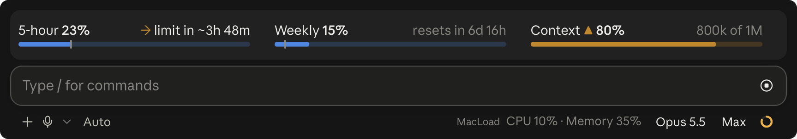

# Rate limits for Claude Code

A Claude Code mod that keeps your 5-hour and weekly usage limits on screen, as two slim meters right above the prompt.



In the terminal:

```
5-hour ▲ 86%   → limit in ~22m · resets in 2h 46m     Weekly 75%                  resets in 6h 16m
━━━━━━━━━━━━━━━━━━━━━━┿━━━━━━━━━━━━━━━╸──────────      ━━━━━━━━━━━━━━━━━━━━━━━━━━━━━━━━━━━━━╸──────┼──
```

## What it shows

- **Each limit window** as a meter: blue normally, amber with ▲ from 80%, red with ◆ from 95%.
- **A tick on each meter** marking how far through the window you are. Fill past the tick means you are using the limit faster than it resets.
- **A forecast** when you are on course to run out before the reset, such as "→ limit in ~22m".
- **Reset countdowns**, and a toast when a window crosses 80% and again at 95%.
- **How full this chat's context window is**, as a third meter, once a reply has reported it.
- **Your limits as soon as a chat opens.** Each chat saves its latest reading, and a new chat shows the newest one ("as of 12m ago") until its own first reply. Open chats also pick up newer readings from each other once a minute.

It reads the rate-limit information Claude Code already receives with each reply. It makes no requests of its own, and nothing leaves your machine.

## Requirements

- Claude Code 2.1.288 or later. Mods are an early-access feature, so a Claude Code update may break this mod; please open an issue if it does.
- A Claude subscription (Pro or Max). Claude Code only receives rate-limit information on a subscription.
- The meters show in the Claude desktop app's Code tab and in the terminal.

## Install

```bash
git clone https://github.com/Heuwzen/claude-code-rate-limits ~/.claude/skills/rate-limits
```

New chats load it automatically. Update with `git -C ~/.claude/skills/rate-limits pull`, and uninstall by deleting the folder.

To keep it somewhere else, add its folder to the `env` block of `~/.claude/settings.json` instead:

```json
"env": { "CLAUDE_CODE_PLUGIN_DIRS": "/path/to/claude-code-rate-limits" }
```

## Development

```bash
claude plugin validate .
claude plugin test .
```

Once Claude Code has loaded the mod, `.claude-plugin/types/` holds the API types, and `tsc -p .` type-checks it.

## License

MIT
